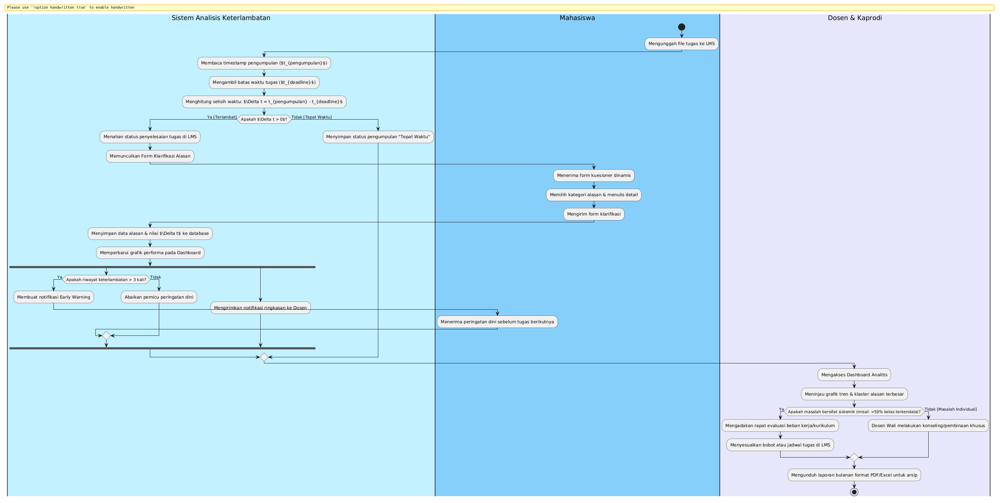
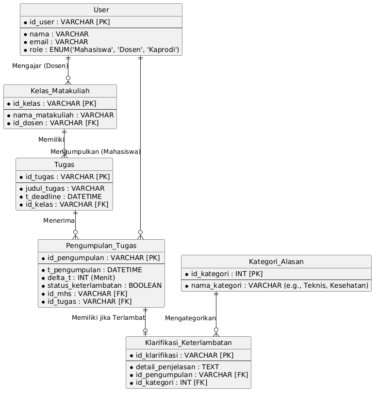
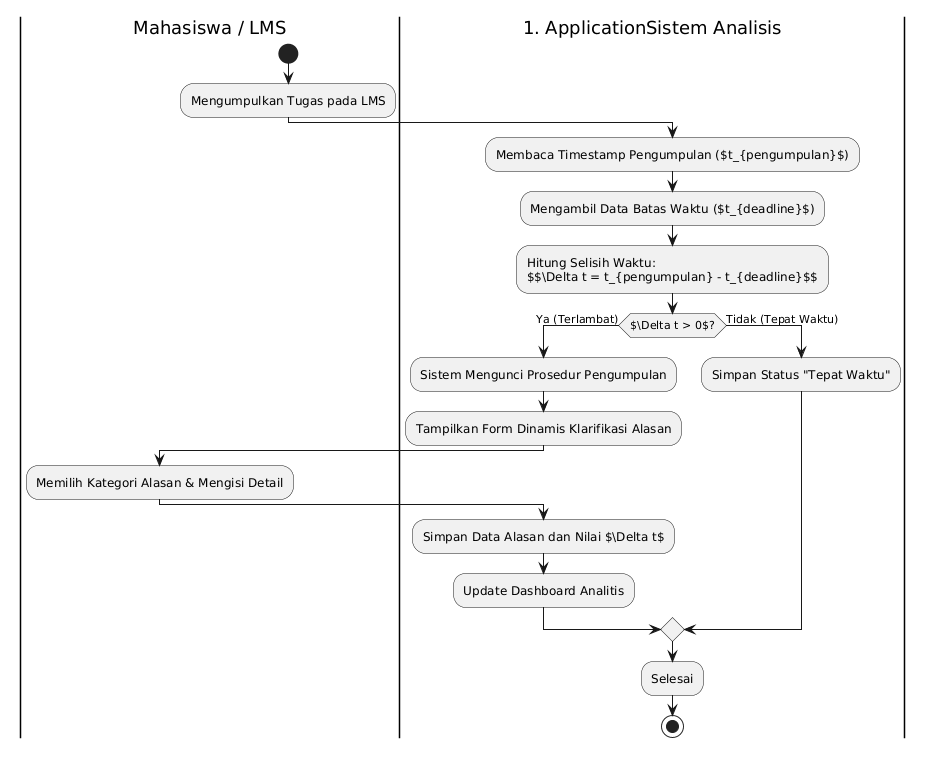
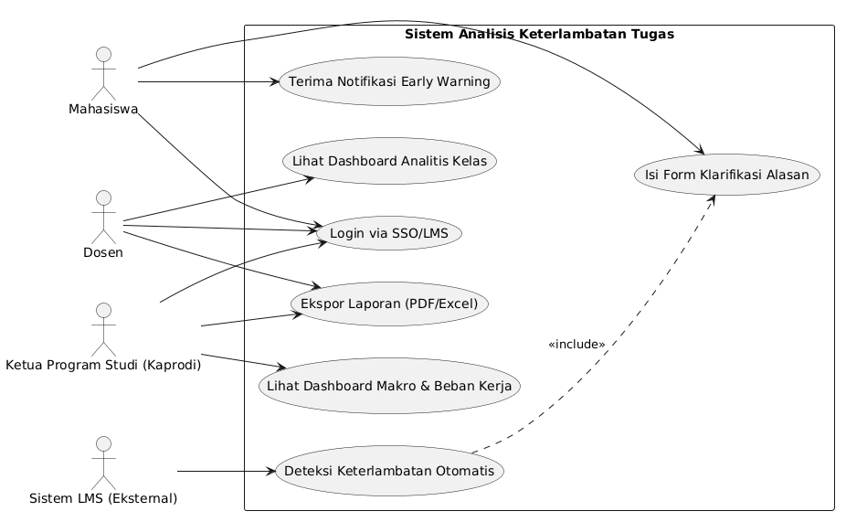

# APSI

## Ringkasan Diagram di `docs`

- `BPMN.png`
  - Diagram alur proses bisnis (Business Process Model and Notation).
  - Menunjukkan langkah-langkah utama, keputusan, dan urutan aktivitas dalam proses sistem.

- `ERD.png`
  - Diagram relasi entitas (Entity Relationship Diagram).
  - Menggambarkan tabel atau entitas utama, atribut penting, dan hubungan antarentitas.

- `Activity Diagram.png`
  - Diagram aktivitas.
  - Menjelaskan aliran kerja atau proses internal sistem, termasuk langkah berurutan dan percabangan.

- `Use Case Diagram.png`
  - Diagram use case.
  - Menunjukkan aktor yang berinteraksi dengan sistem dan fungsi-fungsi utama yang disediakan sistem.

## Catatan

Semua gambar berada di folder `docs`. Jika ingin menampilkan gambar langsung di `README.md`, gunakan tag Markdown seperti:

```markdown




```
